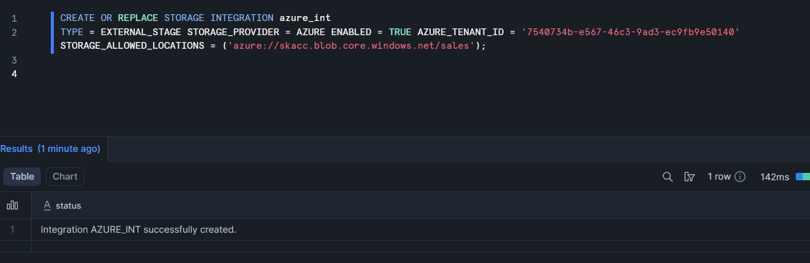

# <p align='center'> Snowflake Training - Case Study </p>
### Name: Saravana Kumar S
Superset ID: 5371342<br>
College: Saveetha Engineering college

## Problem Statement:
Case Study: Azure → Snowflake with Snowpark, then Power BI
Scenario <br>
You’re the data engineer at ItTechGenie Retail. Sales teams drop monthly CSVs into an Azure Storage container. <br>
You must:
upload the CSV to Azure,
ingest it into Snowflake using Snowpark,
model it into proper database/schema/table, and
build a quick Power BI report for business users.

### Intially upload the dataset in Azure Blob storage:


### Ingest into Snowflake using Snowpark:

1. Connecting snowflake and azure blob storage:


2. Creating stage:


3. Using Snowpark to load data:
```py
from snowflake.snowpark import Session
from snowflake.snowpark.functions import col
from snowflake.snowpark.types import StructType, StructField, StringType, DateType, IntegerType, FloatType

connection_parameters = {...
}

session = Session.builder.configs(connection_parameters).create()
csv_schema = StructType([
    StructField("ORDERID", StringType()),
    StructField("ORDERDATE", StringType()),
    StructField("MONTHOFSALE", StringType()),
    StructField("CUSTOMERID", StringType()),
    StructField("CUSTOMERNAME", StringType()),
    StructField("COUNTRY", StringType()),
    StructField("REGION", StringType()),
    StructField("CITY", StringType()),
    StructField("CATEGORY", StringType()),
    StructField("SUBCATEGORY", StringType()),
    StructField("QUANTITY", IntegerType()),
    StructField("DISCOUNT", FloatType()),
    StructField("SALES", FloatType()),
    StructField("PROFIT", FloatType())
])


df = session.read \
    .schema(csv_schema) \
    .option("PARSE_HEADER", True) \
    .csv("@azure_stage_sas/Retail_Sales.csv")
```


4. Transforming the dataset:
```py
from snowflake.snowpark.functions import col, to_date, year, month, when, lit
df_transformed = (
    df
    .dropna()
    .with_column("ORDERDATE", to_date(col("ORDERDATE"), "YYYY-MM-DD"))
    .filter((col("SALES") > 0) & (col("PROFIT") > 0))

    .with_column("PROFIT_MARGIN", col("PROFIT") / col("SALES"))
    .with_column(
        "PERFORMANCE_CATEGORY",
        when(col("PROFIT_MARGIN") > 0.3, lit("High Profit"))
        .when(col("PROFIT_MARGIN") > 0.15, lit("Medium Profit"))
        .otherwise(lit("Low Profit"))
    )
    .with_column(
        "DISCOUNT_IMPACT",
        when(col("DISCOUNT") > 0.2, lit("High Discount"))
        .when(col("DISCOUNT") > 0, lit("Low Discount"))
        .otherwise(lit("No Discount"))
    )
)
df_transformed.show()
```


### Power-BI visualization:
1. Sum of sales by region and by country:

2. Sum of Sales based on Month of sale

3. Sales by category and sub-category

4. Performance category and Discount impact:

5. Summary Table:
